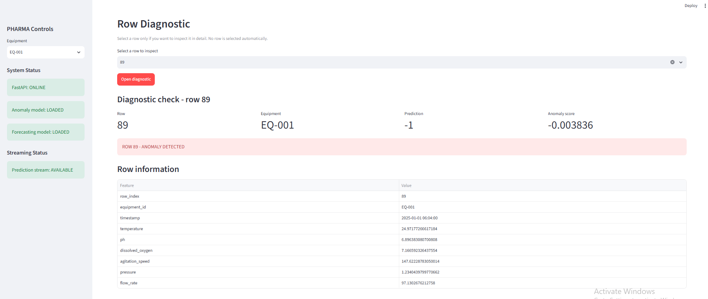
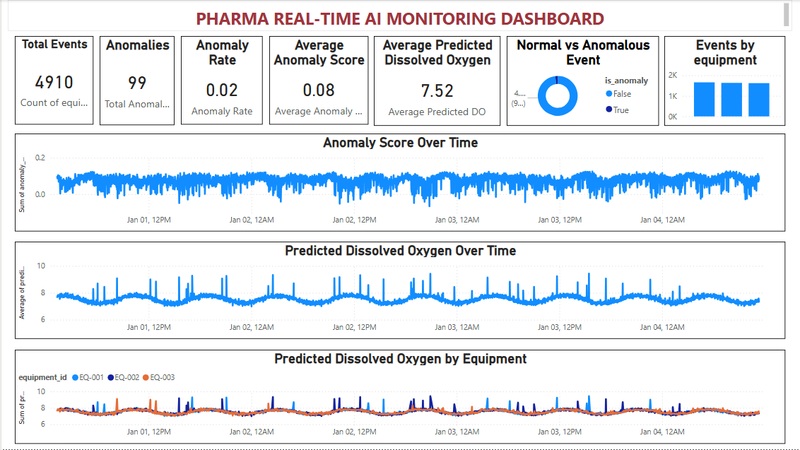

# PHARMA – Real-Time AI Platform

A real-time artificial intelligence platform for pharmaceutical process monitoring, anomaly detection, dissolved oxygen forecasting, streaming inference, operational monitoring, and Power BI analytics.

The project combines data preparation, machine learning, local event-driven inference, REST API serving, experiment tracking, automated testing, monitoring dashboards, and business intelligence.

> **Project status:** Core local implementation fully implemented and validated.
>
> **Prepared extensions:** Kafka, PostgreSQL/SQLAlchemy, Docker, additional ML components, and cloud deployment have been prepared or considered for future industrialization.
>
> **Azure deployment:** Target architecture designed but not deployed because no Azure subscription was available during development.

---

## 1. Project Overview

The objective of this project is to design and implement a real-time AI pipeline for pharmaceutical process monitoring.

The platform processes simulated sensor measurements such as:

- Temperature
- pH
- Dissolved oxygen
- Agitation speed
- Pressure
- Flow rate

Two machine learning tasks are currently implemented:

1. **Anomaly detection** using Isolation Forest
2. **Dissolved oxygen forecasting** using Random Forest Regressor

The predictions are used through a local streaming inference pipeline, REST API, Streamlit monitoring dashboard, and Power BI analytics.

The project also contains several prepared components intended for future production industrialization. These components are clearly separated from the current validated implementation.

---

## 2. Current Implementation vs Prepared Extensions

The project contains three categories of components.

### 🟢 Currently implemented and validated

The following components are part of the current working pipeline:

- Python
- Pandas
- NumPy
- Scikit-learn
- Isolation Forest
- Random Forest Regressor
- Joblib
- MLflow
- FastAPI
- Uvicorn
- Streamlit
- Plotly
- Matplotlib
- Seaborn
- Pytest
- Python-based streaming
- JSON Lines (JSONL)
- Power BI Desktop
- Git / GitHub
- PowerShell

### 🟡 Prepared for future extensions

The following technologies or components were prepared or considered but are not required by the current validated pipeline:

- Random Forest Classifier
- SQLAlchemy
- PostgreSQL
- TimescaleDB
- `psycopg`
- Kafka
- `kafka-python`
- Docker
- Docker Compose
- Statsmodels
- StandardScaler
- MinMaxScaler
- TimeSeriesSplit
- Database environment variables
- Kafka environment variables

These components provide possible evolution paths for the project.

### 🔵 Future production / cloud architecture

The following components represent possible future industrialization:

- Azure IoT Hub
- Azure Event Hubs
- Azure Stream Analytics
- Azure Machine Learning
- Azure Data Lake Storage Gen2
- Azure ML Model Registry
- Azure API Management
- Azure Monitor
- Azure DevOps / CI/CD
- Real IoT devices
- Real-time Power BI integration
- Data drift monitoring
- Model performance monitoring
- Centralized logging and observability
- Production-grade authentication and API security

---

## 3. Tools & Technologies

### Programming & Development

- **Python** – main programming language
- **Jupyter Notebook** – experimentation, data preparation, feature engineering, and machine learning workflow
- **Git** – source code version control
- **GitHub** – source code repository and documentation
- **PowerShell** – local development and execution environment

### Data Science & Machine Learning

- **Pandas** – data manipulation and analysis
- **NumPy** – numerical computation
- **Scikit-learn** – machine learning algorithms and evaluation
- **Joblib** – model serialization and persistence
- **MLflow** – experiment tracking

### Current Machine Learning Models

- **Isolation Forest** – unsupervised anomaly detection
- **Random Forest Regressor** – dissolved oxygen forecasting

### Prepared Machine Learning Components

The project also contains preparation for possible future machine learning extensions:

- **Random Forest Classifier** – possible future supervised classification task
- **TimeSeriesSplit** – possible advanced temporal cross-validation
- **StandardScaler / MinMaxScaler** – possible preprocessing experiments
- **Statsmodels** – possible statistical or time-series modelling approaches

These components are not part of the current final model pipeline unless explicitly used by a corresponding script.

---

## 4. Streaming & Real-Time Processing

### Current implementation

The current streaming layer is implemented in Python.

The main components are:

```text
src/streaming/producer.py
src/streaming/inference.py
src/streaming/consumer.py
````

The local architecture is:

```text
Producer → Inference → Consumer
```

The producer simulates the arrival of pharmaceutical sensor events.

The inference component applies the trained machine learning models.

The consumer stores the resulting prediction events in JSON Lines format.

### Kafka preparation

Kafka is **not used in the current validated implementation**.

The project nevertheless contains preparation for a possible Kafka-based architecture, including:

* `kafka-python`
* `KafkaProducer`
* `KafkaConsumer`
* Kafka environment variables
* Kafka topic configuration

Possible future architecture:

```text
Producer
   ↓
Kafka Topic
   ↓
Inference / Consumer
```

Kafka could therefore replace or extend the current local Python streaming layer in a production architecture.

Azure Event Hubs is another possible production alternative.

---

## 5. Database & Persistence Preparation

### Current implementation

The current pipeline stores prediction results locally using:

```text
JSON Lines (JSONL)
CSV
```

The main outputs are:

```text
exports/stream_predictions.jsonl
exports/powerbi_predictions.csv
```

### PostgreSQL / SQLAlchemy preparation

The project also contains preparation for a possible database persistence layer.

Prepared technologies include:

* SQLAlchemy
* psycopg
* PostgreSQL
* TimescaleDB
* PostgreSQL-related environment variables

These components are **not required by the current local inference pipeline**.

They are intended as a possible future persistence layer for:

* sensor data
* prediction events
* anomaly results
* forecasting results
* operational data

Possible future architecture:

```text
Streaming
    ↓
Inference
    ↓
PostgreSQL / TimescaleDB
    ↓
Analytics / Monitoring
```

---

## 6. Docker Preparation

Docker was considered during the project structuring phase as a possible containerization solution.

The project structure was prepared for a possible Docker-based deployment.

However, Docker is **not part of the current validated GitHub implementation** and is not required to run the current local pipeline.

Possible future containerization could include:

* FastAPI
* Streamlit
* MLflow
* PostgreSQL
* Kafka
* Streaming services

Docker should therefore be considered a **future deployment option**, not a currently deployed component.

---

## 7. Environment Configuration

The project uses environment variables to separate configuration from application code.

The `.env.example` file contains configuration examples for components such as:

* MLflow
* PostgreSQL
* Kafka
* application services
* future infrastructure integrations

Example variables include:

```text
MLFLOW_TRACKING_URI
DATABASE_URL
KAFKA_BOOTSTRAP_SERVERS
KAFKA_TOPIC
```

The presence of a variable in `.env.example` does not necessarily mean that the corresponding service is currently active.

For example, Kafka and database variables are prepared for future integrations.

Real credentials and secrets should not be committed to the repository.

---

## 8. Architecture

The current local architecture is:

```text
PHARMA REAL-TIME AI

┌──────────────────────────┐
│ Simulated Sensor Data    │
│ generate_data.py         │
└────────────┬─────────────┘
             │
             ▼
┌──────────────────────────┐
│ Data Validation          │
│ validate_data.py         │
└────────────┬─────────────┘
             │
             ▼
┌──────────────────────────┐
│ Feature Engineering      │
│ build_features.py        │
└────────────┬─────────────┘
             │
             ▼
┌──────────────────────────┐
│ Machine Learning         │
│ Isolation Forest         │
│ Random Forest Regressor  │
└────────────┬─────────────┘
             │
             ▼
┌──────────────────────────┐
│ Local Streaming          │
│ Producer → Inference     │
│ → Consumer               │
└────────────┬─────────────┘
             │
       ┌─────┴──────┐
       ▼            ▼
┌─────────────┐ ┌──────────────┐
│  FastAPI    │ │ Predictions  │
│  REST API   │ │ JSONL / CSV  │
└──────┬──────┘ └──────┬───────┘
       │               │
       ▼               ▼
┌─────────────┐ ┌──────────────┐
│  Streamlit  │ │   Power BI   │
│  Monitoring │ │   Analytics  │
└─────────────┘ └──────────────┘
```

The architecture is designed so that the local streaming and storage layers can later be replaced or extended with production technologies such as Kafka, PostgreSQL, Azure Event Hubs, or Azure services.

---

## 9. Machine Learning

### Anomaly Detection

The anomaly detection component uses:

**Isolation Forest**

The model analyses selected process and lag features and identifies observations that differ from normal operating behaviour.

### Dissolved Oxygen Forecasting

The forecasting component uses:

**Random Forest Regressor**

The model predicts the next dissolved oxygen value based on selected process variables and historical lag features.

### Prepared Classification Extension

A **Random Forest Classifier** was also considered as a possible future supervised classification model.

It is not part of the current final prediction pipeline.

---

## 10. Data Usage for Training, Evaluation and Streaming

The local streaming pipeline is a simulation designed to demonstrate the complete end-to-end functioning of the platform.

The project uses the generated sensor dataset as the common data source for the different stages of the pipeline.

The data flow is:

```text
Generated sensor data
        ↓
sensor_data.csv
        ↓
Data validation
        ↓
sensor_data_clean.csv
        ↓
Feature engineering
        ↓
features.csv
        ↓
Model training and evaluation
        ↓
Saved models (.joblib)
        ↓
producer.py
        ↓
Simulated streaming
        ↓
inference.py
        ↓
Predictions
        ↓
Streamlit / Power BI
```

### Model Training and Evaluation

The machine learning models are trained using the generated feature dataset.

The anomaly detection model uses Isolation Forest.

For dissolved oxygen forecasting, the data is split chronologically:

* 80% of the observations are used for model training;
* 20% are kept as a test set;
* MAE and RMSE are calculated on the 20% test portion.

The chronological split is used because the data represents a time-series process.

### Streaming Simulation

The streaming demonstration does not generate a second independent dataset.

Instead, `producer.py` reads the existing `features.csv` file and emits its rows sequentially as simulated sensor events.

Therefore:

```text
features.csv
    ↓
Row 1 → Event 1 → Inference → Prediction
Row 2 → Event 2 → Inference → Prediction
Row 3 → Event 3 → Inference → Prediction
...
```

The producer therefore acts as a local simulation of a real-time sensor data source.

The streaming results should be understood as an **inference demonstration on the existing dataset**, not as an independent model benchmark on a completely new unseen dataset.

The forecasting model is evaluated separately on the chronological 20% test portion.

---

## 11. Feature Engineering

Feature engineering is implemented as a separate project component.

The project contains reusable feature definitions in:

```text
src/features/feature_definitions.py
```

Feature construction is performed by:

```text
scripts/build_features.py
```

The feature engineering process includes historical lag variables used to provide temporal information to the machine learning models.

Examples include:

```text
dissolved_oxygen_lag_1
dissolved_oxygen_lag_10
dissolved_oxygen_lag_30
```

The resulting feature dataset is used by the machine learning pipeline and the local streaming simulation.

---

## 12. Streaming Pipeline

The current streaming implementation is located in:

```text
src/streaming/
├── producer.py
├── inference.py
└── consumer.py
```

### Producer

`producer.py` reads the existing `features.csv` dataset and emits its rows sequentially as simulated pharmaceutical process events.

Each event contains process information, timestamps, equipment information, and dissolved oxygen lag features.

The producer acts as a local simulation of a real-time sensor source.

### Inference

`src/streaming/inference.py` validates each incoming event and performs:

* anomaly prediction;
* anomaly scoring;
* anomaly classification;
* dissolved oxygen forecasting.

The saved `.joblib` models are loaded and applied to incoming events.

### Consumer

`consumer.py` stores prediction events in JSON Lines format.

Output:

```text
exports/stream_predictions.jsonl
```

The architecture separates:

```text
Event generation
       ↓
Machine learning inference
       ↓
Prediction persistence
```

This structure can later be adapted to Kafka or Azure Event Hubs.

---

## 13. REST API

The project exposes the machine learning functionality through FastAPI.

Main endpoints include:

```text
GET /
GET /health
POST /predict
```

Example health response:

```json
{
  "status": "healthy",
  "anomaly_model": true,
  "forecasting_model": true
}
```

Example prediction output contains:

```text
anomaly_prediction
is_anomaly
anomaly_score
predicted_dissolved_oxygen
```

The API provides an interface between the machine learning models and external applications.

---

## 14. Monitoring Dashboard

A Streamlit dashboard provides operational monitoring of the platform.

The dashboard displays:

* total analysed rows;
* number of anomalies;
* number of normal observations;
* anomaly rate;
* model availability;
* streaming status;
* latest streaming prediction.

### Monitoring Screenshots





---

## 15. Power BI Dashboard

Prediction data is exported for Power BI through:

```text
exports/powerbi_predictions.csv
```

The Power BI dashboard contains:

* Total Events
* Anomalies
* Anomaly Rate
* Average Anomaly Score
* Average Predicted Dissolved Oxygen
* Normal vs Anomalous Events
* Events by Equipment
* Anomaly Score Over Time
* Predicted Dissolved Oxygen Over Time
* Predicted Dissolved Oxygen by Equipment

Power BI Desktop was used locally to build the analytical dashboard.

The current implementation uses exported prediction data.

A future extension could provide a more direct real-time Power BI integration.

### Power BI Screenshot



---

## 16. Experiment Tracking

MLflow is used locally to track machine learning experiments.

The experiment tracks parameters and metrics for the training runs.

Example metrics include:

```text
MAE
RMSE
```

The experiment records the current model configuration, including:

```text
IsolationForest
RandomForestRegressor
```

MLflow provides experiment tracking and a foundation for future model lifecycle management.

---

## 17. Automated Testing

The project includes automated tests covering the main functional components.

The test suite covers:

* API endpoints
* data availability
* feature contracts
* machine learning models
* model prediction
* streaming producer
* streaming inference
* streaming consumer
* end-to-end streaming

The complete local test suite reports:

```text
30 passed
```

The tests are implemented using Pytest.

---

## 18. Results

The complete core pipeline was validated locally.

### Automated Tests

```text
30 passed
```

### Streaming Inference Demonstration

The streaming generator produced:

```text
4,910 events
```

The complete inference pipeline processed:

```text
4,910 events
```

Results:

```text
Anomalies: 99
Normal events: 4,811
Anomaly rate: 2.02%
Average anomaly score: 0.0775
Average predicted DO: 7.5233
```

These results correspond to the inference demonstration performed by replaying the existing processed feature dataset through the local streaming pipeline.

They should not be interpreted as an independent benchmark on a new unseen dataset.

The forecasting model is evaluated separately using the chronological 20% test portion described in the data evaluation section.

The prediction results were exported to:

```text
exports/powerbi_predictions.csv
```

---

## 19. Project Structure

The current GitHub repository contains the following structure:

```text
pharma-realtime-ai/
│
├── docs/
│   └── images/
│       ├── PHARMA_Real_Time_AI_anomaly_monitoring.PNG
│       ├── Pharma_Real_Time AI Platforme on Azure.png
│       ├── Powerbi_Dashboard.PNG
│       ├── Process_Overview_Process_Variable.PNG
│       ├── Row_Diagnostic.PNG
│       └── Streaming_event_history_Anomalies_by_equipment.PNG
│
├── exports/
│   ├── powerbi_predictions.csv
│   └── stream_predictions.jsonl
│
├── scripts/
│   ├── build_features.py
│   ├── generate_data.py
│   └── validate_data.py
│
├── src/
│   ├── api/
│   │   ├── __init__.py
│   │   └── main.py
│   │
│   ├── dashboard/
│   │   ├── __init__.py
│   │   ├── app.py
│   │   ├── app_backup_before_streaming.py
│   │   └── export_powerbi.py
│   │
│   ├── features/
│   │   ├── __init__.py
│   │   └── feature_definitions.py
│   │
│   ├── inference/
│   │   └── __init__.py
│   │
│   ├── models/
│   │   ├── __init__.py
│   │   └── train.py
│   │
│   └── streaming/
│       ├── __init__.py
│       ├── consumer.py
│       ├── inference.py
│       └── producer.py
│
├── tests/
│   ├── __init__.py
│   ├── test_api.py
│   ├── test_data.py
│   ├── test_features.py
│   ├── test_ml.py
│   └── test_streaming.py
│
├── .env.example
├── .gitignore
├── README.md
├── pharma-realtime-a.ipynb
└── requirements.txt
```

### Structure notes

* `src/api/` contains the FastAPI application.
* `src/dashboard/` contains the Streamlit dashboard and Power BI export logic.
* `src/features/` contains reusable feature definitions.
* `src/models/` contains model training code.
* `src/streaming/` contains the current local streaming implementation.
* `src/inference/` is currently reserved for a possible future standalone inference layer. The current event-level inference implementation is located in `src/streaming/inference.py`.
* `scripts/` contains data generation, validation, and feature-building utilities.
* `tests/` contains automated tests.
* `exports/` contains generated prediction outputs.
* `docs/images/` contains project and dashboard screenshots.

The file `app_backup_before_streaming.py` is a previous dashboard version kept as a backup and is not the main dashboard entry point.

Some generated or local directories are intentionally not versioned through `.gitignore`, including generated datasets, trained model artifacts, MLflow local artifacts, and local environment files.

---

## 20. Local Data and Generated Artifacts

Some project directories are used locally but are not necessarily visible in the GitHub repository.

Typical local working directories include:

```text
data/
├── raw/
└── processed/
```

Generated model artifacts can include:

```text
models/
├── anomaly_model.joblib
└── forecasting_model.joblib
```

MLflow local tracking can use:

```text
mlruns/
```

These generated files are excluded from version control where appropriate.

The repository therefore contains the code required to reproduce the processing pipeline without necessarily storing every generated dataset or model artifact.

---

## 21. Local Installation

Create a Python virtual environment:

```bash
python -m venv .venv
```

Activate it on Linux/macOS:

```bash
source .venv/bin/activate
```

Activate it on Windows PowerShell:

```powershell
.venv\Scripts\Activate.ps1
```

Install the project dependencies:

```bash
pip install -r requirements.txt
```

---

## 22. Running the Data Pipeline

Generate the sensor dataset:

```bash
python scripts/generate_data.py
```

Validate the generated data:

```bash
python scripts/validate_data.py
```

Build the feature dataset:

```bash
python scripts/build_features.py
```

The resulting data is then used by the machine learning and streaming pipeline.

---

## 23. Running the API

Start FastAPI with:

```bash
python -m uvicorn src.api.main:app --host 127.0.0.1 --port 8000
```

The API is then available locally.

Interactive API documentation is available through the FastAPI documentation endpoint.

Main endpoints:

```text
GET /
GET /health
POST /predict
```

---

## 24. Running the Dashboard

Start Streamlit with:

```bash
streamlit run src/dashboard/app.py --server.port 8502
```

The dashboard can then be accessed through the local Streamlit URL displayed in the terminal.

---

## 25. Running the Tests

Run the complete test suite:

```bash
python -m pytest tests -v
```

Expected result:

```text
30 passed
```

---

## 26. Running the Streaming Pipeline

The current local streaming pipeline is composed of:

```text
src/streaming/producer.py
src/streaming/inference.py
src/streaming/consumer.py
```

The conceptual flow is:

```text
features.csv
    ↓
producer.py
    ↓
inference.py
    ↓
consumer.py
    ↓
exports/stream_predictions.jsonl
```

The producer replays the existing feature dataset row by row.

The inference component loads the trained models and generates predictions.

The consumer stores the prediction events.

---

## 27. Azure Target Architecture

The project was designed with a possible Microsoft Azure industrialization path.

| Current / Local Component | Possible Azure Target              |
| ------------------------- | ---------------------------------- |
| Simulated sensor data     | Azure IoT Hub                      |
| Python streaming          | Azure IoT Hub / Event Hubs         |
| Streaming processing      | Azure Stream Analytics             |
| Isolation Forest          | Azure Machine Learning             |
| Random Forest Regressor   | Azure Machine Learning             |
| `.joblib` models          | Azure ML Model Registry            |
| FastAPI                   | Azure ML endpoint / API Management |
| Local prediction exports  | Azure Data Lake Storage Gen2       |
| Monitoring                | Azure Monitor                      |
| Power BI                  | Power BI                           |
| MLflow                    | Azure Machine Learning / MLflow    |

### Target Architecture

```text
Industrial Equipment
        │
        ▼
Azure IoT Hub
        │
        ▼
Azure Event Hubs
        │
        ▼
Azure Stream Analytics
        │
        ├──────────────────────┐
        ▼                      ▼
Azure Machine Learning    Azure Data Lake
        │                  Storage Gen2
        ▼
ML Inference Endpoint
        │
        ▼
Azure API Management
        │
        ├─────────────────┐
        ▼                 ▼
    Power BI        Azure Monitor
```

This architecture represents a **proposed cloud deployment architecture**.

No Azure resources were provisioned during the project.

### Azure Architecture Diagram


---

## 28. Prepared Production Extensions

### Database

Possible future integration:

```text
Application / Streaming
        ↓
SQLAlchemy
        ↓
PostgreSQL / TimescaleDB
```

The current application does not depend on this database layer.

### Event Streaming

Possible future integration:

```text
Sensor / IoT
    ↓
Kafka or Azure Event Hubs
    ↓
Streaming Processing
    ↓
ML Inference
```

Kafka is therefore considered a possible production event-streaming technology, but is not used by the current local implementation.

### Containerization

Possible future deployment:

```text
Docker
 ├── FastAPI
 ├── Streamlit
 ├── MLflow
 ├── PostgreSQL
 └── Streaming services
```

Docker is prepared as a future deployment option but is not required for the current local execution.

### Machine Learning

Possible future extensions include:

* Random Forest classification
* additional forecasting models
* Statsmodels-based time-series modelling
* TimeSeriesSplit validation
* model comparison
* hyperparameter optimization
* model versioning
* model monitoring
* data drift monitoring

---

## 29. Limitations

The main limitation is the absence of an Azure subscription during development.

Consequently:

* no Azure resources were provisioned;
* no cloud endpoint was deployed;
* no Azure IoT Hub was connected to physical equipment;
* no Azure Machine Learning endpoint was deployed;
* no Azure Data Lake was used for production storage;
* no Azure Event Hubs pipeline was deployed;
* no Azure Stream Analytics job was deployed.

The local streaming pipeline is also a simulation.

It replays the existing `features.csv` dataset rather than receiving new measurements from physical sensors or an external IoT platform.

Therefore, the streaming results demonstrate the functioning of the end-to-end inference architecture, but they are not an independent evaluation of model performance on a completely new unseen dataset.

The forecasting model is evaluated separately using a chronological 80/20 train-test split, with MAE and RMSE calculated on the 20% test portion.

---

## 30. Future Improvements

Possible future extensions include:

### Data & Infrastructure

* PostgreSQL / TimescaleDB persistence
* SQLAlchemy database layer
* integration with real IoT devices
* Azure IoT Hub ingestion
* Azure Event Hubs
* Azure Data Lake Storage Gen2
* Docker-based deployment

### Streaming

* Kafka-based event streaming
* Azure Event Hubs
* Azure Stream Analytics
* scalable distributed streaming architecture

### Machine Learning

* Random Forest classification
* additional forecasting models
* statistical time-series modelling
* advanced temporal cross-validation
* model comparison
* hyperparameter optimization
* model versioning
* model monitoring
* data drift monitoring

### Application & Operations

* real-time Power BI integration
* production-grade authentication
* API security
* centralized logging
* observability
* automated CI/CD
* cloud monitoring

These elements are considered future extensions and are not presented as currently deployed functionality.

---

## 31. Conclusion

PHARMA Real-Time AI demonstrates an end-to-end machine learning architecture for pharmaceutical process monitoring.

The current local implementation integrates:

* data generation;
* data validation;
* feature engineering;
* anomaly detection;
* dissolved oxygen forecasting;
* streaming inference;
* REST API serving;
* experiment tracking;
* operational monitoring;
* Power BI analytics;
* automated testing;
* model persistence;
* local event-driven processing.

The local implementation was validated with:

```text
30 automated tests passing
4,910 events processed through the inference pipeline
```

The streaming pipeline intentionally reuses the existing processed feature dataset as its event source.

This allows the complete real-time inference architecture to be demonstrated locally without physical IoT equipment or cloud streaming infrastructure.

The forecasting model is evaluated separately using a chronological 80/20 train-test split, with MAE and RMSE calculated on the 20% test portion.

The project also contains prepared extensions for:

* Kafka;
* PostgreSQL / TimescaleDB;
* SQLAlchemy;
* Docker;
* Random Forest classification;
* advanced time-series modelling;
* cloud deployment.

These components are intentionally separated from the current validated implementation and provide possible paths toward future production industrialization.

---

## 32. Tools & Methods

This project demonstrates practical experience across the Data Science and AI lifecycle:

* Python development
* Data preparation and validation
* Feature engineering
* Time-series process data
* Unsupervised machine learning
* Supervised machine learning
* Anomaly detection
* Forecasting
* Real-time inference
* Event-driven architecture
* REST API development
* Model persistence
* Experiment tracking
* Automated testing with Pytest
* Operational monitoring
* Streamlit
* Plotly
* Power BI
* Git and GitHub
* PowerShell
* Database integration preparation
* Kafka integration preparation
* Docker/containerization preparation
* Cloud architecture design
* Microsoft Azure architecture
* AI/ML productionization concepts

The project therefore demonstrates not only model development, but also the engineering, testing, integration, monitoring, and visualization aspects required to transform a Data Science model into an operational AI product.

```


